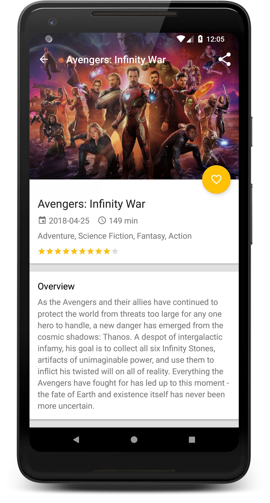

# Popular Movies

**Platform: Android (Min SDK: 19, Target SDK: 27)**

**Author: [Timotius Oktorio](https://ca.linkedin.com/in/timotiusoktorio "LinkedIn Profile") (toktorio@gmail.com)**

Simple movie search app that can help you discover popular, top rated, now playing, and upcoming movies.

*This app was created as the first and second project of [Android Developer Nanodegree](https://www.udacity.com/course/android-developer-nanodegree-by-google--nd801) program at Udacity.*

*This app uses the [themoviedb](https://www.themoviedb.org/documentation/api) API but is not endorsed or certified by themoviedb.*

### Features
- Discover movies by popularity, top rated, now playing, or upcoming.
- View a movie details (title, poster, release date, overview, trailers, reviews, etc).
- Watch trailers directly in YouTube app by tapping a trailer in the trailers list.
- Save movies to favorites for offline viewing (no login required).
- Share a movie trailer url to friends by tapping the share icon.
- User interface tailored for both phone and tablet screens.

### What I have learned from this project
- Using Android HttpURLConnection API to fetch data from *themoviedb* API.
- Using Android SQLite database API to store and retrieve data locally.
- Using AsyncTaskLoader to load data efficiently in the background thread.
- Using [MVP (Model-View-Presenter)](https://en.wikipedia.org/wiki/Model%E2%80%93view%E2%80%93presenter) software architectural pattern.
- Designing layouts for multiple screen sizes (phone and tablet screens).
- Incorporating third-party libraries to speed up development process.

  

Get the apk file [here](https://github.com/toktorio/Popular-Movies/blob/master/app/release/popular-movies.apk?raw=true) to install the app on your device. Note that depending on your device settings, you might need to allow installation from unknown sources in order to install this app. Visit this [link](https://www.androidcentral.com/unknown-sources) for the detailed instructions.